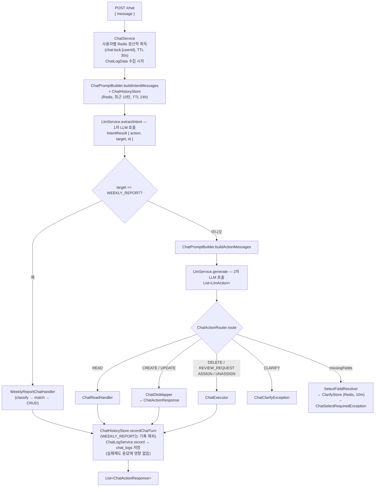
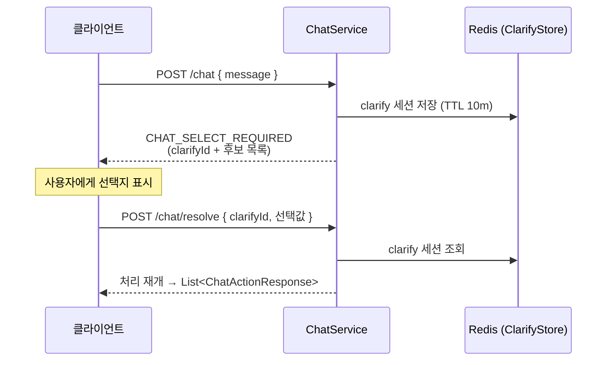

# LLM Chat

자연어 메시지를 받아 의도를 분석하고, 프론트엔드가 바로 폼을 조립할 수 있는 액션 JSON을 반환하는 파이프라인이다.
주간보고 CRUD도 이 파이프라인을 통해 처리된다.

## 요청 처리 흐름



## clarify(선택 필요) 흐름

LLM이 대상을 특정하지 못하면 `CHAT_SELECT_REQUIRED` 오류와 함께 `clarifyId` 및 후보 목록을 반환한다.
클라이언트는 사용자에게 선택지를 보여준 뒤 `POST /chat/resolve` 로 선택값을 전송하면 처리가 재개된다.
clarify 세션은 Redis에 10분간 보관된다 (`chat:clarify:{userId}:{clarifyId}`).



## LLM 제공자 설정

세 제공자를 모두 설정해도 **우선순위: OpenRouter > Gemini > Ollama** 순으로 활성화된 첫 번째가 사용된다.
`isEnabled` 조건은 `apiKey`(또는 `baseUrl`) + `model` 둘 다 비어 있지 않아야 한다.

| 제공자 | 활성화 조건 | 설정 키 접두사 |
|--------|------------|--------------|
| OpenRouter | `OPENROUTER_API_KEY` + `OPENROUTER_MODEL` | `llm.openrouter` |
| Gemini | `GEMINI_API_KEY` + `GEMINI_MODEL` | `llm.gemini` |
| Ollama | `OLLAMA_URL` + `OLLAMA_MODEL` | `llm.ollama` |

공통 설정:

| 키 | 설명 | 기본값 |
|----|------|--------|
| `llm.temperature` | 샘플링 temperature | `0.1` |
| `llm.timeout-ms` | LLM API 응답 타임아웃 (ms) | `60000` |

> LLM 호출 실패 시 최대 3회 지수 backoff(1s → 2s → 4s) 재시도 후 `LLM_SERVICE_UNAVAILABLE` 반환.

> **토큰 사용량**: 현재 OpenRouter만 실값 집계. Gemini / Ollama는 응답에 사용량 정보가 포함되지 않아 0으로 기록된다 (TODO: 추출 구현 예정).

## chat_logs 테이블

chat 1턴의 LLM 파이프라인 실행 기록을 append-only 방식으로 저장한다.
응답 흐름과 완전히 분리되어 저장 실패는 무시된다 (디버깅 전용).

| 컬럼 | 타입 | 설명 |
|------|------|------|
| `id` | BIGSERIAL | PK |
| `user_id` | BIGINT | 요청 사용자 ID |
| `request_message` | TEXT | 사용자 입력 메시지 |
| `success` | BOOLEAN | 파이프라인 전체 성공 여부 |
| `intent_result` | TEXT | 1차 LLM 결과 JSON (`IntentResult`) — 실패 시 null |
| `action_result` | TEXT | 2차 LLM 결과 JSON (액션 목록) — weekly_report 우회·실패 시 null |
| `error_message` | TEXT | 실패 시 예외 메시지 |
| `intent_input_tokens` | INTEGER | 1차 LLM 입력 토큰 수 |
| `intent_output_tokens` | INTEGER | 1차 LLM 출력 토큰 수 |
| `action_input_tokens` | INTEGER | 2차 LLM 입력 토큰 수 |
| `action_output_tokens` | INTEGER | 2차 LLM 출력 토큰 수 |
| `cost` | NUMERIC(16,8) | 총 비용 (USD) — input/output 토큰 × 저장 시점 단가 |
| `model` | VARCHAR(128) | cost 산출 기준 모델명 (단가 이력 추적용) |
| `created_at` / `updated_at` | TIMESTAMP | 생성·수정 시각 |

인덱스: `(user_id, id DESC)` — 사용자별 최신 로그 조회 최적화.

## 프롬프트 회귀 테스트 (promptfoo)

[promptfoo](https://www.promptfoo.dev/)로 LLM 프롬프트를 회귀 테스트한다.
**운영에서 실제로 사용하는 프롬프트 파일**(`src/main/resources/llm/intent-prompt.txt`, `system-prompt.txt`)을
그대로 로드해 테스트하므로, 프롬프트를 수정하면 코드 변경 없이 바로 검증할 수 있다.

### 구조

```
promptfoo/
  promptfooconfig.yaml      # 테스트 정의 (provider, prompts, tests)
  transform-vars.js         # 운영 프롬프트 파일 + context fixture 로드
  context-fixture.json      # 기본 CONTEXT (스마트팩토리/모바일POS/사내포털 시나리오)
  context-task-create.json  # 태스크 생성 + 담당자 매칭 전용 fixture
```

- Provider: `openrouter:google/gemini-2.5-flash` (운영과 동일 계열 모델로 평가)
- 각 테스트는 LLM 응답 JSON을 파싱해 `action` / `target` / `id` 등 필드를 assert 한다.

### 테스트 그룹

| 그룹 | 대상 프롬프트 | 검증 내용 |
|------|-------------|----------|
| `[intent]` | intent-prompt | 자연어 → `action`/`target` 의도 분류 (create/read/update/delete/assign/review_request/clarify) |
| `[intent-history]` | intent-prompt | 대화 히스토리 참조 — "아까 만든거", "그거 삭제" 등에서 이전 턴의 id/target 이어받기 |
| `[system]` | system-prompt | CONTEXT 기반 액션 생성 — id 매칭, 동명 항목 `missing_fields`+후보 반환, 날짜·상태 변환, 필터 조합 |
| `[system-task-create]` | system-prompt | 태스크 생성 시 epic 멤버 기준 담당자(`assignee_id`) 매칭 |

### 실행법

```bash
npm install                          # promptfoo 설치 (devDependency)
npm run prompt:eval                  # 전체 테스트 실행
npm run prompt:view                  # 결과를 웹 UI로 확인
```

> 프롬프트(`src/main/resources/llm/*.txt`)를 수정했다면 PR 전에 `npm run prompt:eval`로 회귀 여부를 확인할 것.
