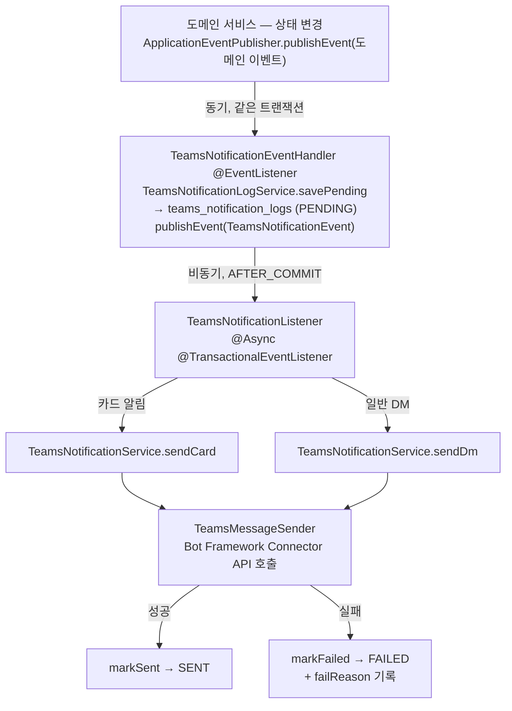

# Microsoft Teams 연동

도메인 이벤트를 통해 관련 사용자에게 Teams DM 또는 Adaptive Card 알림을 발송한다.
사용자가 Teams 앱을 설치하면 Bot Framework를 통해 `serviceUrl`과 `conversationId`가 사용자 레코드에 자동 저장된다.

## 알림 발송 이벤트

| 이벤트 | 알림 유형 | 수신자 | 메시지 형식 |
|--------|----------|--------|-----------|
| `TaskReviewRequestedEvent` | `TASK_REVIEW_REQUEST` | 해당 태스크의 PM | Adaptive Card (리뷰 요청 카드) |
| `TaskApprovedEvent` | `TASK_APPROVE` | 태스크 담당자 | DM |
| `TaskRejectedEvent` | `TASK_REJECT` | 태스크 담당자 | DM (사유 포함) |
| `TaskAssignedEvent` | `TASK_ASSIGN` | 태스크 담당자 | DM |
| `EpicAssignedEvent` | `EPIC_ASSIGN` | 배정된 사용자 | DM |
| `EpicUnassignedEvent` | `EPIC_UNASSIGN` | 배정 해제된 사용자 | DM |
| `ProjectPmAssignedEvent` | `PROJECT_PM_ASSIGN` | 배정된 PM | DM |

## 알림 발송 흐름



**트랜잭션 보장**: 알림 로그 저장(`PENDING`)은 도메인 변경과 같은 TX에서 원자적으로 처리된다.
실제 외부 API 호출은 커밋 이후 비동기로 수행되므로, 외부 장애가 도메인 트랜잭션에 영향을 주지 않는다.

## Teams Bot Webhook 수신

Teams 앱이 설치되거나 사용자가 메시지를 보내면 `POST /teams/messages`로 Activity가 수신된다.

| Activity 타입 | 처리 |
|--------------|------|
| `installationUpdate` (add) | Microsoft Graph API로 사용자 정보 조회 → `provisionFromTeams` (자동 가입 또는 복원) → 환영 메시지 발송 |
| `message` (value 있음) | `AsyncChatHandler`로 채팅 파이프라인 연결 |
| `message` (value 없음) | "채팅 기능은 현재 비활성화" 안내 응답 |

Teams Bot JWT 검증은 `TeamsApiClient.verifyBotToken`에서 수행한다.
Microsoft OpenID 메타데이터에서 JWK를 가져와 서명 검증 + `aud` / `iss` 클레임 확인 (JWK 캐시 TTL: 24h).

## teams_notification_logs 테이블

| 컬럼 | 타입 | 설명 |
|------|------|------|
| `id` | BIGSERIAL | PK |
| `user_id` | BIGINT | 수신 대상 사용자 ID |
| `type` | VARCHAR(32) | 알림 유형 (`TeamsNotificationType` 열거값) |
| `message` | VARCHAR(2000) | 발송 메시지 본문 |
| `status` | VARCHAR(16) | `PENDING` → `SENT` / `FAILED` |
| `fail_reason` | VARCHAR(1000) | 실패 사유 (최대 1000자) |
| `created_at` / `updated_at` | TIMESTAMP | 생성·수정 시각 |

인덱스: `(user_id, id DESC)`.

## Teams 앱 설정

### Azure Bot 등록

1. Azure Portal에서 **Azure Bot** 리소스를 생성하고 Microsoft App ID / 클라이언트 보안 비밀을 발급받는다.
   → 각각 `TEAMS_APP_ID` / `TEAMS_APP_PASSWORD`로 서버에 주입된다.
2. 메시징 엔드포인트를 `https://<서버 도메인>/api/teams/messages`로 설정한다.
3. 채널 설정에서 **Microsoft Teams** 채널을 활성화한다.

### Teams 앱 패키지 (`pms-bot/`)

저장소의 `pms-bot/` 디렉토리가 Teams에 업로드하는 앱 패키지다.

| 파일 | 설명 |
|------|------|
| `manifest.json` | Teams 앱 매니페스트 (스키마 v1.17) — 앱 이름 "PMS Bot", scopes: `personal` / `team` / `groupChat` |
| `color.png` / `outline.png` | 앱 아이콘 (컬러 / 외곽선) |

- `manifest.json`의 `id`와 `bots[].botId`는 **Azure Bot의 앱 ID(`TEAMS_APP_ID`)와 동일해야 한다.**
- `isNotificationOnly: false` — 알림 발송뿐 아니라 사용자가 봇에게 보내는 메시지 수신(채팅 파이프라인)도 지원한다.

### 업로드 (관리자에게 ZIP 전달)

Teams 관리 센터는 별도의 관리자 계정 담당자가 관리하므로, 직접 업로드하지 않고 **ZIP 파일을 만들어 담당자에게 전달**한다.

```bash
cd pms-bot
zip pms-bot.zip manifest.json color.png outline.png
```

담당자에게 요청할 내용:

> Teams 관리 센터(https://admin.teams.microsoft.com) → **Teams 앱 → 앱 관리**에서 **"PMS Bot v1"** 선택 → **앱 업데이트**에서 첨부한 ZIP 파일로 업데이트

매니페스트를 수정했다면 `version`을 올린 뒤 ZIP을 다시 만들어 전달해야 반영된다.

사용자가 앱을 설치하면 `installationUpdate` Activity가 수신되어 자동 가입(provision)과
`serviceUrl` / `conversationId` 저장이 이루어진다. → [Teams Bot Webhook 수신](#teams-bot-webhook-수신)

## 설정 키

| 환경 변수 | 설명 |
|----------|------|
| `TEAMS_APP_ID` | Azure Bot 앱 ID (`teams.app-id`) |
| `TEAMS_APP_PASSWORD` | Azure Bot 앱 비밀번호 (`teams.app-password`) |
| `TEAMS_TENANT_ID` | Azure 테넌트 ID (`teams.tenant-id`) — Graph API 토큰 발급 시 사용 |
| `API_URL` | 알림 카드의 링크 URL (`domain.url`) |

> API 키, 테넌트 ID 등 실제 값은 저장소가 아니라 **배포 서버의 `api.yml`(docker compose) `environment` 블록**에서 주입된다.
>
> **stage 환경에서는 Teams가 비활성화되어 있다.** 테스트 중 실제 사용자에게 메시지가 발송되는 것을 막기 위해 stage 서버에는 Teams 환경 변수를 주입하지 않는다 (yml 매핑은 존재하지만 값이 비어 있어 동작하지 않음).
